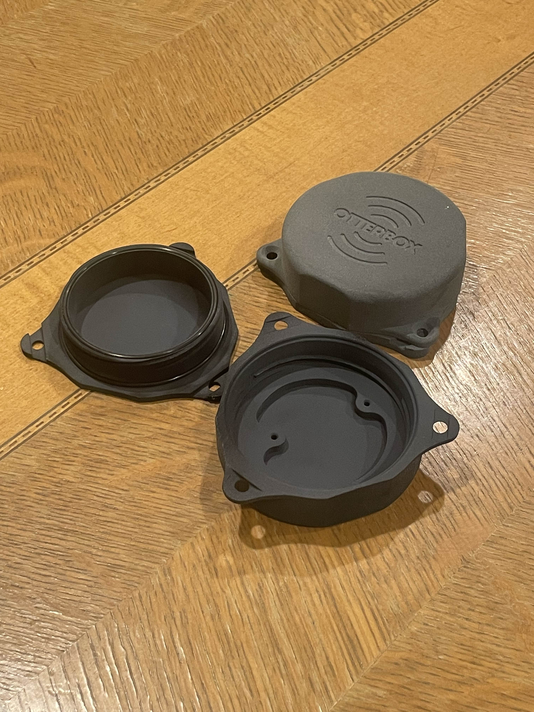
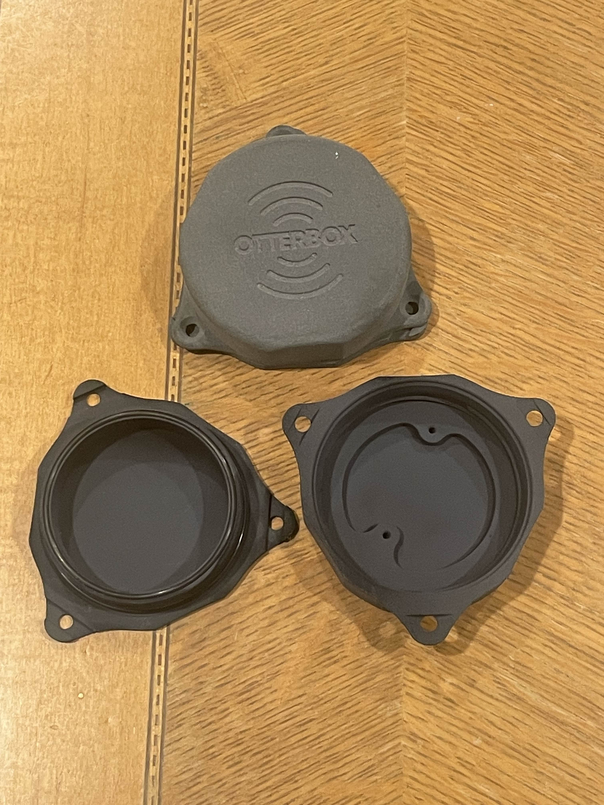
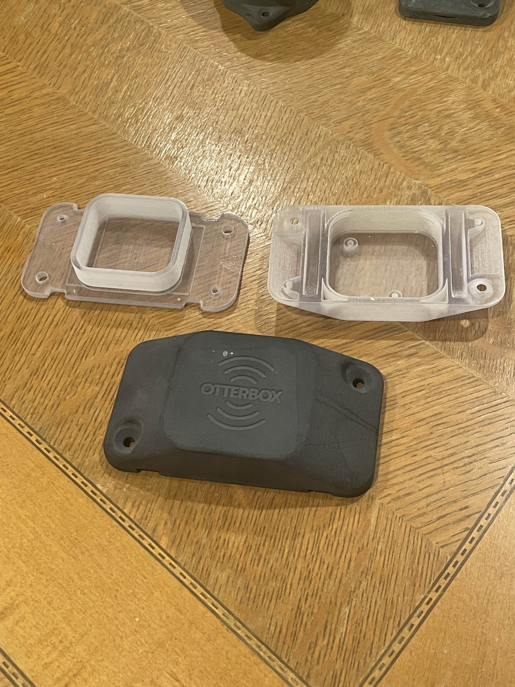
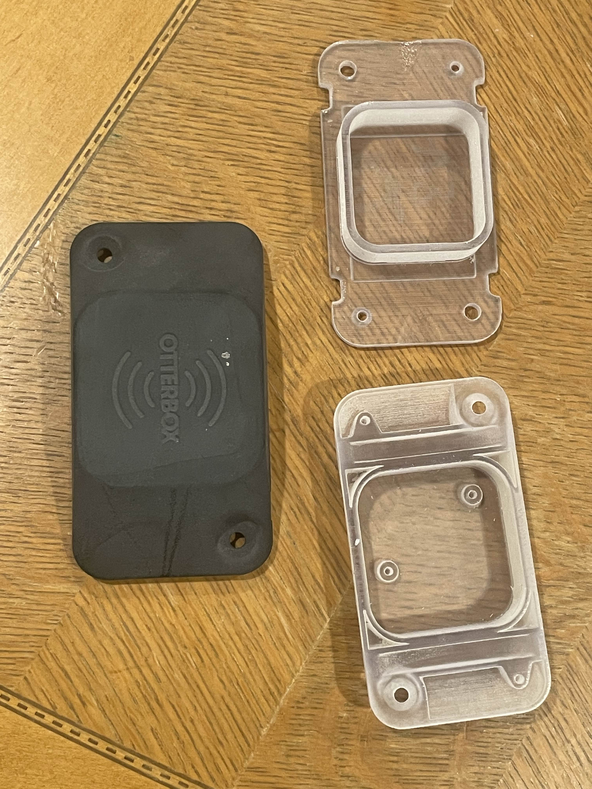
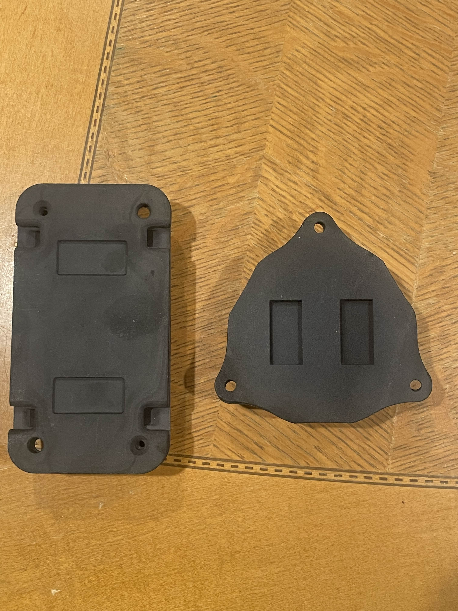

# 🦾 Otter Products Electronics Enclosure
*Electronics enclosure for a small receiver circuit*

---

## 🚀 Overview
- The details of this project regarding purpose and usage are confidential under the OtterBox Tech-Dev Division.
- Mechanical design only — electronics details omitted due to NDA
- I acted as head mechanical engineer for the majority of this project: CAD development, DFM adjustments for prototype iteration, and delivered demo presentations to global partners in the consumer electronics, oil & gas, and logistics sectors
- Worked very closely with Solutions Architect, who gave feedback directly from clients

---

## 🧠 Key Features
- 🔹 Two Main Designs
  - 🔹Keyshot used for texture displacement and logo application
  - 🔹Circular Design
    - 🔹3D printable design
    - 🔹Double O-ring sealed waterproofing
    - 🔹Thread lock into place with snap lock
    - 🔹Ziptie, screw, and magnetic mounting accessible
    
    
  - 🔹Rectangular Design
    - 🔹Robust, Rugged "OtterBox" form factor
    - 🔹No threads, lid snaps into place; locked in with small screws
    - 🔹Single O-ring sealed waterproofing
    - 🔹Ziptie, screw, and magnetic mounting accessible
      - 🔹Ziptie slots are fully integrated into the lid, with internal curvature ensuring ziptie alignment during installment
    
    
  - 🔹Application Points
    
    
---

## 🛠️ Technical Details

| Aspect | Description                                                     |
|:--|:----------------------------------------------------------------|
| **Tools / Languages** | SolidWorks, Keyshot, Photoshop, Blender                         |
| **Libraries / Frameworks** | N/A                                                             |
| **Hardware Used** | 3D-printed parts, O-rings, Zipties, Screws, Electronic Hardware |
| **Fabrication** | FDM/SLS/Polyjet 3D printing, Bead Blasting                      |
| **Data I/O** | STEP/STL models, .gcode,                                        |

---

## ⚙️ Setup & Installation
- Minimal assembly is required with the choice of securing an enclosure using zipties, magnets, or screws, 
